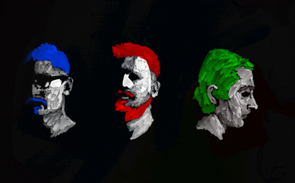
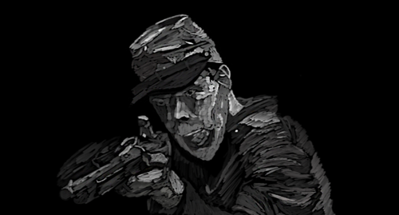

<!--
// MD RULES
// Text can be **bold**, _italic_, or ~~strikethrough~~.
// #Word is h1, ##Word is h2, ###Word is h3, et cetera
// * is for UL
// 1., 2., 3. for OL
// For tables: 
// | head1        | head two          | three |
// |:-------------|:------------------|:------|
// | ok           | good swedish fish | nice  |
// | out of stock | good and plenty   | nice  |
// For horizontal line: "* * *"
// Small Image: 
// Large Image
// Definition Lists can be used with html syntax: <dl>, <dt>name</dt><dd>Godzilla</dd></dl>
-->

 
 
<!-- Dropdown -->
This is my personal website.  It's under heavy construction and will continue to be.  Last updated 9/18/2025. &copy; Dylan Rhymaun MMXXV


<select id="menu">
  <option value="">Select a section</option>
  <option value="one">Art</option>
  <option value="two">Words</option>
  <option value="three">Games</option>
</select>


<!-- Sections -->

    <section id="one" class="hidden">
    <h2>Art</h2>
    
        
        
        
        
        
          
        
        
        
        
        
        
        
        
        
        
        
        
        
        
        
        
        
        
        
        
        
        
        
        
        
        
        
        
        
        
        
        
        
        
        
        
        
        
        
    </section>
    <section id="two" class="hidden">
      <h2>Words</h2>
      <h3>Blog</h3>
        <ul>
          <!--<li><a href="./writing/fun/favoriteAlbumsOAT.html">My Favorite Albums Spreadsheet</a></li>-->
          <li><a href="./writing/fun/albumsof2024.html">My 15 Favorite Albums of 2024</a></li>
          <li><a href="./writing/fun/songsof2024.html">My 20 favorite songs of 2024</a></li>
          <li><a href="./writing/fun/othermusicof2024.html">Other Music I listened to in 2024</a></li>
        </ul>
      <h3>Articles & Essays</h3>
        <ul>
          <li><a href="./writing/professional/timeloopsminit.html">Time Loops and Escapism in Minit</a></li>
          <li><a href="./writing/professional/moralityin10cloverfield.html">Morality in 10 Cloverfield Lane</a></li>
          <li><a href="./writing/professional/velvetbuzzsaw.html">Velvet Buzzsaw Review & Analysis</a></li>
          <li><a href="./writing/professional/velvetbuzzsaw.html">Link to test of Velvet Buzzsaw Essay</a></li>
          <li><a href="./writing/professional/comeandseereview.html">Come and See Review & Analysis</a></li>
          <li><a href="./writing/professional/20230131.html">A BIPOC perspective of the 2022 CCRPC ECOS Report</a></li>
          <li><a href="./writing/professional/20230228.html">A Vermonter’s Political Power</a></li>
          <li><a href="./writing/professional/20230531.html">Contemporary BIPOC Representation in Media</a></li>
          <li><a href="./writing/professional/20230731.html">The Job Hunter’s AI</a></li>
          <li><a href="./writing/professional/20231031.html">The Realities of Health Inequity in Vermont</a></li>
        </ul>
          <h3>Canned Fish Reviews</h3>
    </section>
    <section id="three" class="hidden">
    <h2>Games</h2>                
      ###Galactix
      
       <a href="https://crispy-chicken.itch.io/galactix">Link to Itch.io Page</a>
      
I was really excited to get back into Game making for the 2024 GMTK jam, but my contributions were smaller than I hoped this year. I assembled a team of 7 this time, making it clear that I focused on 3D art, but the team took a turn and opted for a 2D game. I made the UI, title screen, player, enemy, and machine sprites, but the really impressive pixel art was done by a pixel artist I asked to join last minute. Lessons for next time I guess.

      ###Space Ops
      
       <a href="https://yaboyled.itch.io/spaceops">Link to the Itch.io Page</a>
      
I served as the sole artist on a team of 4 people for the 2021 GMTK game jam. Space Ops was a simple wave based top down shooter. Pretty fun to work on, not the most impressive game ever made.
    </section>

